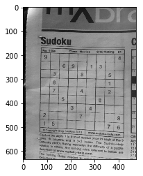
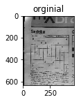
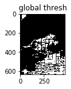
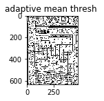
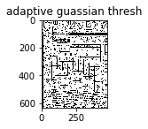

```python
import numpy as np
import matplotlib.pyplot as plt

```


```python
import pandas as pd

```


```python
pip install opencv-python
```

    Collecting opencv-python
    [?25l  Downloading https://files.pythonhosted.org/packages/5e/7e/bd5425f4dacb73367fddc71388a47c1ea570839197c2bcad86478e565186/opencv_python-4.1.1.26-cp36-cp36m-manylinux1_x86_64.whl (28.7MB)
        100% |████████████████████████████████| 28.7MB 537kB/s eta 0:00:01    44% |██████████████▏                 | 12.6MB 3.5MB/s eta 0:00:05��██▌            | 17.4MB 48.9MB/s eta 0:00:01
    [?25hRequirement already satisfied: numpy>=1.11.3 in /srv/conda/lib/python3.6/site-packages (from opencv-python) (1.16.3)
    Installing collected packages: opencv-python
    Successfully installed opencv-python-4.1.1.26
    Note: you may need to restart the kernel to use updated packages.


```python
pip install opencv-contrib-python
```

    Collecting opencv-contrib-python
    [?25l  Downloading https://files.pythonhosted.org/packages/33/9b/1f9ef069206002d0bbca80598193904ce1ae2a990e7465bc351b1264c7d8/opencv_contrib_python-4.1.1.26-cp36-cp36m-manylinux1_x86_64.whl (34.7MB)
        100% |████████████████████████████████| 34.7MB 537kB/s eta 0:00:01    31% |██████████▏                     | 11.0MB 84.5MB/s eta 0:00:01
    [?25hRequirement already satisfied: numpy>=1.11.3 in /srv/conda/lib/python3.6/site-packages (from opencv-contrib-python) (1.16.3)
    Installing collected packages: opencv-contrib-python
    Successfully installed opencv-contrib-python-4.1.1.26
    Note: you may need to restart the kernel to use updated packages.


```python
!wget "https://raw.githubusercontent.com/satyamuralidhar/opencv/master/adaptive%20tresh/sudoku.jpg"
```

    --2019-09-26 09:13:20--  https://raw.githubusercontent.com/satyamuralidhar/opencv/master/adaptive%20tresh/sudoku.jpg
    Resolving raw.githubusercontent.com (raw.githubusercontent.com)... 151.101.0.133, 151.101.64.133, 151.101.128.133, ...
    Connecting to raw.githubusercontent.com (raw.githubusercontent.com)|151.101.0.133|:443... connected.
    HTTP request sent, awaiting response... 200 OK
    Length: 48239 (47K) [image/jpeg]
    Saving to: ‘sudoku.jpg’
    
    sudoku.jpg          100%[===================>]  47.11K  --.-KB/s    in 0.02s   
    
    2019-09-26 09:13:20 (2.26 MB/s) - ‘sudoku.jpg’ saved [48239/48239]
    


```python
import cv2
img = cv2.imread('sudoku.jpg',0)
```


```python
img1 = cv2.medianBlur(img , 3)
```


```python
import matplotlib.pyplot as plt
```


```python
ret,th1 = cv2.threshold(img1 , 165 , 255 , cv2.THRESH_BINARY)
th2 = cv2.adaptiveThreshold(img1 , 255, cv2.ADAPTIVE_THRESH_MEAN_C , cv2.THRESH_BINARY,11,2)
th3=cv2.adaptiveThreshold(img1 , 255, cv2.ADAPTIVE_THRESH_GAUSSIAN_C,cv2.THRESH_BINARY,11,2)
plt.imshow(img1 , 'gray')
```


    <matplotlib.image.AxesImage at 0x7f84cd299a20>





```python
titles = ['orginial' , 'global thresh' , 'adaptive mean thresh ' , 'adaptive guassian thresh']
images = [img1 , th1 , th2 , th3]
for i in range(4):
    plt.subplot(2,2,i+1)
    plt.imshow(images[i] ,'gray')
    plt.title(titles[i])
    #plt.xticks([])
    #plt.yticks([])
    plt.show()
```














```python

```
